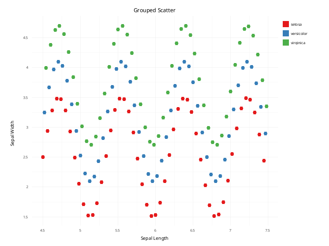
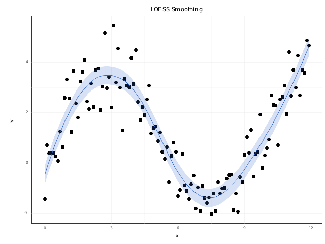
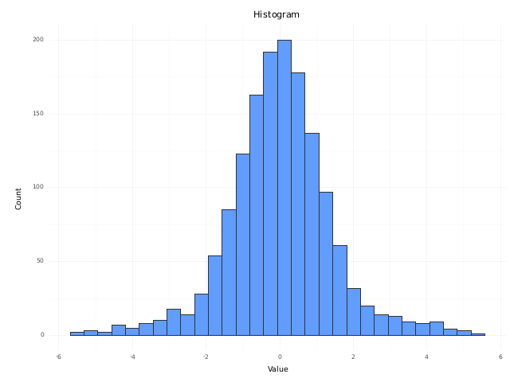
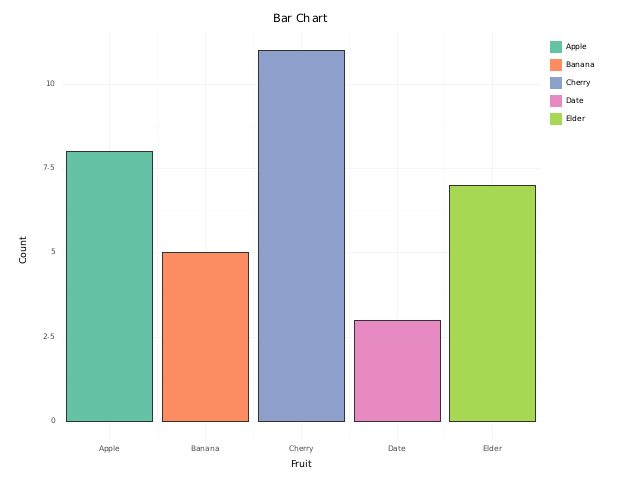
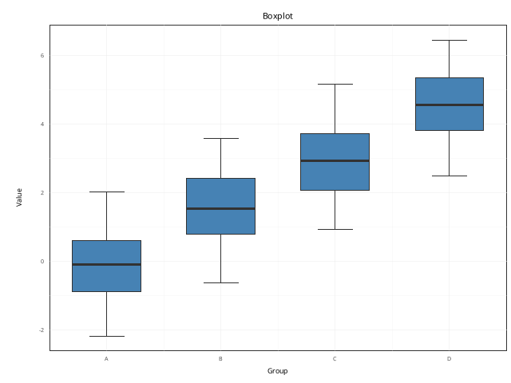
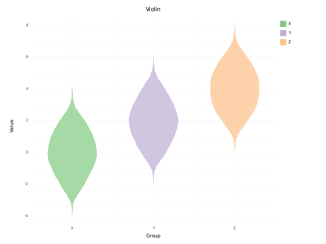
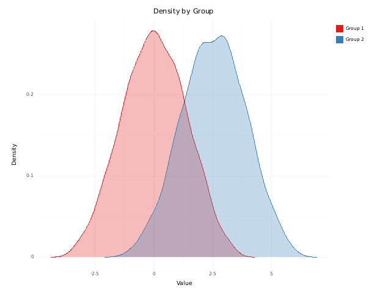
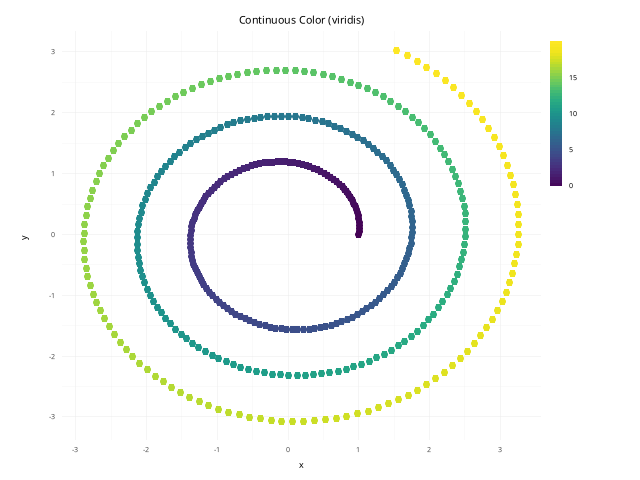
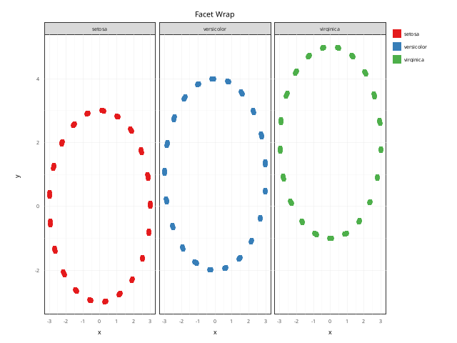

# ggplot-rs

[](https://github.com/sipemu/ggplot-rs/actions/workflows/ci.yml)
[](https://crates.io/crates/ggplot-rs)
[](https://docs.rs/ggplot-rs)
[](https://codecov.io/gh/sipemu/ggplot-rs)
[](#license)

A Rust implementation of ggplot2's Grammar of Graphics, rendering through the
[plotters](https://github.com/plotters-rs/plotters) backend.

**No polars required.** [polars](https://pola.rs/) is a convenient — and fully
optional — input adapter. The core pipeline runs on its own internal DataFrame,
so you can plot straight from plain Rust vectors, or from
[Apache Arrow](https://arrow.apache.org/) `RecordBatch`es produced by
[DuckDB](https://duckdb.org/) — with polars switched off entirely. See
[Data Input](#data-input) and [Feature Flags](#feature-flags).

## Gallery

Every image below is produced by [`examples/gallery.rs`](examples/gallery.rs) —
regenerate them all with `cargo run --example gallery`.

<table>
  <tr>
    <td align="center">
      <br>
      <sub>Grouped scatter · <code>geom_point</code> + Brewer palette</sub>
    </td>
    <td align="center">
      <br>
      <sub>LOESS trend + CI band · <code>geom_smooth</code></sub>
    </td>
  </tr>
  <tr>
    <td align="center">
      <br>
      <sub>Histogram · <code>geom_histogram</code></sub>
    </td>
    <td align="center">
      <br>
      <sub>Bar chart · <code>geom_bar</code> + fill palette</sub>
    </td>
  </tr>
  <tr>
    <td align="center">
      <br>
      <sub>Grouped boxplots · <code>geom_boxplot</code></sub>
    </td>
    <td align="center">
      <br>
      <sub>Grouped violins · <code>geom_violin</code></sub>
    </td>
  </tr>
  <tr>
    <td align="center">
      <br>
      <sub>Overlapping densities · <code>geom_density</code></sub>
    </td>
    <td align="center">
      <br>
      <sub>Continuous color · viridis gradient</sub>
    </td>
  </tr>
  <tr>
    <td align="center" colspan="2">
      <br>
      <sub>Small multiples · <code>facet_wrap</code></sub>
    </td>
  </tr>
</table>

## Quick Start

```rust
use ggplot_rs::prelude::*;
use polars::prelude::*;

fn main() -> Result<(), Box<dyn std::error::Error>> {
    let df = df! {
        "sepal_length" => [5.1, 4.9, 4.7, 7.0, 6.4],
        "sepal_width"  => [3.5, 3.0, 3.2, 3.2, 3.2],
        "species"      => ["setosa", "setosa", "setosa", "versicolor", "versicolor"],
    }?;

    GGPlot::new(df)
        .aes(Aes::new().x("sepal_length").y("sepal_width").color("species"))
        .geom_point()
        .save("scatter.svg")?;

    Ok(())
}
```

## Features

### Geoms

`geom_point`, `geom_line`, `geom_bar`, `geom_col`, `geom_histogram`, `geom_boxplot`, `geom_violin`, `geom_smooth`, `geom_density`, `geom_area`, `geom_ribbon`, `geom_errorbar`, `geom_segment`, `geom_rug`, `geom_text`, `geom_label`, `geom_tile`, `geom_raster`, `geom_bin2d`, `geom_hex`, `geom_contour`, `geom_path`, `geom_step`, `geom_hline`, `geom_vline`, `geom_abline`, and more (40+)

### Stats

`StatIdentity`, `StatCount`, `StatBin`, `StatBoxplot`, `StatSmooth` (Lm + Loess), `StatDensity`, `StatLoess`, `StatSummary`, `StatEcdf`, `StatFunction`, `StatEllipse`, `StatContour`, `StatBin2d`, `StatBinHex`, `StatSum`, `StatYDensity`, `StatQQ`, and more

### Scales

- **Continuous**: linear, log10, log2, ln, sqrt, reverse, logit, probit, pseudo-log, reciprocal, exp, and Box–Cox transforms
- **Discrete**: automatic categorical mapping
- **Color**: discrete palettes (Viridis, Brewer Set1/Dark2, etc.), continuous gradients, diverging gradient2, manual color assignment
- **Shape & Linetype**: discrete mapping for point shapes and line styles

### Coordinates

`coord_cartesian`, `coord_flip`, `coord_fixed`

### Faceting

`facet_wrap` and `facet_grid` with configurable free/fixed scales

### Themes

`theme_gray`, `theme_bw`, `theme_classic`, `theme_minimal`, `theme_dark`, `theme_light`, `theme_linedraw`, `theme_void` — plus full customization via `ElementText`, `ElementLine`, `ElementRect`

### Annotations

`annotate_text`, `annotate_rect`, `annotate_segment`

## Data Input

`GGPlot::new` accepts anything implementing the `GGData` trait. Nothing here
requires polars — pick whichever source fits your stack.

**Plain Rust — zero optional dependencies:**

```rust
// Column-oriented
let cols: Vec<(String, Vec<Value>)> = vec![
    ("x".into(), vec![Value::Float(1.0), Value::Float(2.0), Value::Float(3.0)]),
    ("y".into(), vec![Value::Float(4.0), Value::Float(5.0), Value::Float(6.0)]),
];
GGPlot::new(cols)

// Row-oriented
let rows: Vec<HashMap<String, Value>> = vec![/* ... */];
GGPlot::new(rows)
```

**Apache Arrow / DuckDB** — feed a `RecordBatch` straight from a DuckDB query
result, with polars switched off:

```toml
# Cargo.toml — no polars in the dependency tree
ggplot-rs = { version = "0.1", default-features = false, features = ["arrow"] }
```

```rust
let batch: arrow::record_batch::RecordBatch = /* DuckDB query → Arrow */;
GGPlot::new(batch)
```

**polars** (optional, enabled by default) — for `df!` and polars pipelines:

```rust
let df = df! {
    "x" => [1.0, 2.0, 3.0],
    "y" => [4.0, 5.0, 6.0],
}?;
GGPlot::new(df)
```

## Rendering

Save to a file (format inferred from the extension — `svg`, `png`, `jpg`, ...):

```rust
plot.save("out.svg")?;              // 800x600 default
plot.save_with_size("out.png", 1200, 800)?;
plot.ggsave("out.png", 6.0, 4.0, 150.0)?; // width_in, height_in, dpi
```

Or render in memory — no temp files — which is what you want when serving charts
from a web/MCP service:

```rust
let svg: String   = plot.clone().render_svg()?;          // or render_svg_with_size(w, h)
let png: Vec<u8>  = plot.render_png_with_size(400, 300)?; // fully-encoded PNG bytes
```

**Headless / no system fonts.** Rendering uses plotters' `ab_glyph` text backend
with a **bundled font** (DejaVu Sans), not `font-kit`/fontconfig — so text renders
deterministically in a minimal container with no system fonts installed. Nothing
to configure; there is no dependency on the host's font stack.

## Theming & brand color

Everything about a theme is set at **runtime**, so one render process can serve
many tenants' brands without touching chart code.

Inject a **brand/primary color** — it becomes the default for any single-series
geom that has no `color`/`fill` aesthetic mapped (an explicit mapping always wins):

```rust
GGPlot::new(data)
    .aes(Aes::new().x("day").y("count"))
    .geom_col()
    .primary_color((26, 153, 136)) // DataZoo teal — no per-chart color code
    .render_svg()?;
```

Build a whole `Theme` at runtime and compose the brand into it:

```rust
let theme = theme_minimal().with_primary((26, 153, 136));
GGPlot::new(data).aes(/* … */).geom_line().theme(theme);
```

Supply an **arbitrary sequential ramp** (e.g. a green→red risk score) instead of
the built-in viridis/brewer scales — pass explicit `(offset, color)` stops:

```rust
GGPlot::new(data)
    .aes(Aes::new().x("x").y("y").color("risk"))
    .geom_point()
    .scale_color_gradientn(vec![
        (0.0, RGBAColor::new(0, 160, 80)),   // low  = green
        (0.5, RGBAColor::new(240, 200, 0)),  // mid  = amber
        (1.0, RGBAColor::new(200, 40, 40)),  // high = red
    ]);
```

## Feature Flags

| Feature  | Default | Provides                                                        |
| -------- | :-----: | --------------------------------------------------------------- |
| `polars` |   yes   | `impl GGData for polars::DataFrame` + `polars` re-export         |
| `arrow`  |   no    | `impl GGData for arrow::RecordBatch` (Arrow/DuckDB input)        |

To skip the heavy polars dependency (e.g. an Arrow-only service), disable defaults:

```toml
ggplot-rs = { version = "0.1", default-features = false, features = ["arrow"] }
```

## Examples

Run any example with:

```sh
cargo run --example scatter
cargo run --example histogram
cargo run --example bar_chart
cargo run --example continuous_color
cargo run --example density
cargo run --example faceted
cargo run --example loess_smooth
cargo run --example annotations
cargo run --example coord_flip
cargo run --example log_scale
cargo run --example color_palettes
cargo run --example gallery            # regenerates the gallery above
cargo run --example supplier_leadtime  # polars-free; runs with --no-default-features
```

## Dependencies

- [plotters](https://crates.io/crates/plotters) 0.3 — SVG/PNG rendering (`ab_glyph` text backend; no fontconfig)
- [image](https://crates.io/crates/image) 0.24 — in-memory PNG encoding
- [indexmap](https://crates.io/crates/indexmap) 2 — ordered maps for internal data
- [rand](https://crates.io/crates/rand) 0.8 — jitter positioning
- [polars](https://crates.io/crates/polars) 0.46 — DataFrame input *(optional, default)*
- [arrow](https://crates.io/crates/arrow) 53 — Arrow `RecordBatch` input *(optional)*

## License

Licensed under either of

- Apache License, Version 2.0 ([LICENSE-APACHE](LICENSE-APACHE) or <http://www.apache.org/licenses/LICENSE-2.0>)
- MIT license ([LICENSE-MIT](LICENSE-MIT) or <http://opensource.org/licenses/MIT>)

at your option.

Unless you explicitly state otherwise, any contribution intentionally submitted
for inclusion in the work by you, as defined in the Apache-2.0 license, shall be
dual licensed as above, without any additional terms or conditions.

### Bundled font

`assets/fonts/DejaVuSans.ttf` is bundled for headless text rendering. DejaVu Sans
is distributed under a permissive, freely-redistributable license (Bitstream Vera
+ Arev) — see [`assets/fonts/LICENSE-DejaVu.txt`](assets/fonts/LICENSE-DejaVu.txt).
